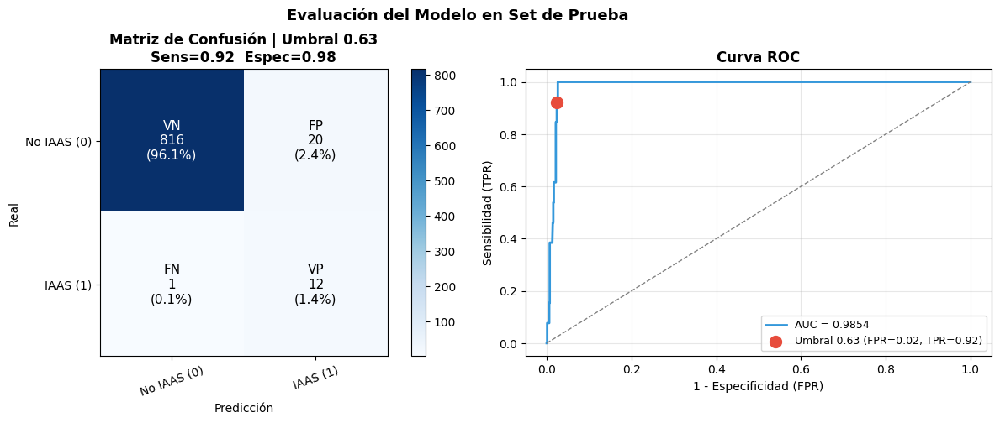
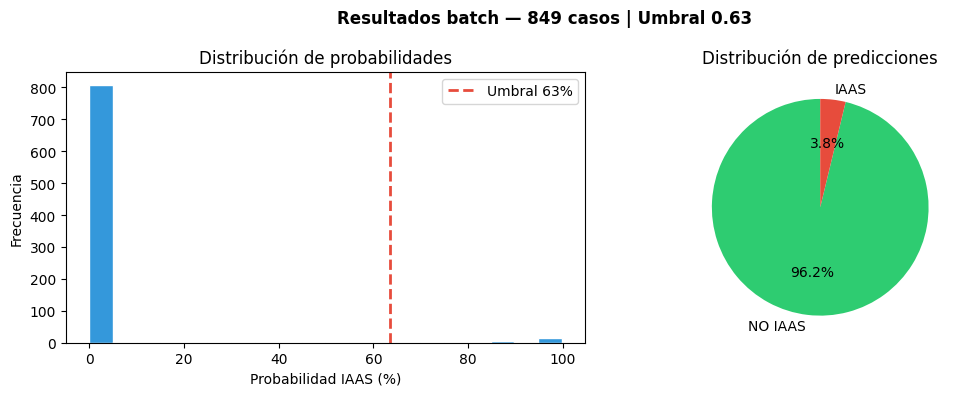
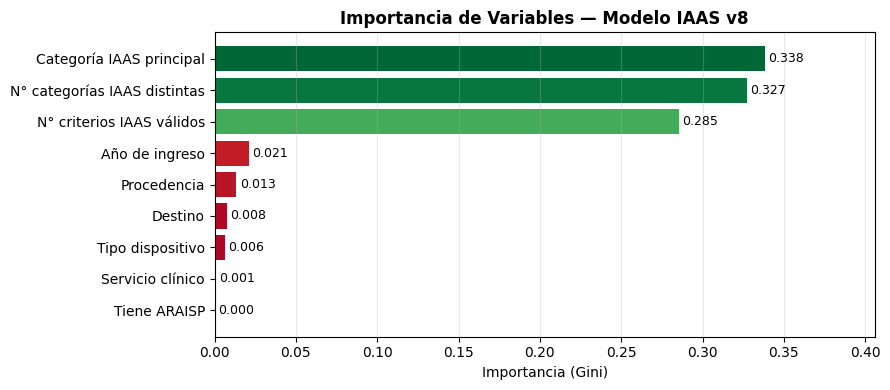

# Predicción de Infecciones Asociadas a la Atención en Salud (IAAS) mediante Inteligencia Artificial

**Proyecto Final — Diplomado en Inteligencia Artificial**
Universidad del Bío-Bío / UBB Capacita

---

## Tabla de contenidos

1. [Descripción del problema](#1-descripción-del-problema)
2. [Estado del arte](#2-estado-del-arte)
3. [Objetivos del proyecto](#3-objetivos-del-proyecto)
4. [Arquitectura del sistema](#4-arquitectura-del-sistema)
5. [Algoritmo de Machine Learning y justificación](#5-algoritmo-de-machine-learning-y-justificación)
6. [Tecnologías y librerías empleadas](#6-tecnologías-y-librerías-empleadas)
7. [Instalación y ejecución](#7-instalación-y-ejecución)
8. [Parámetros de entrenamiento y métricas de evaluación](#8-parámetros-de-entrenamiento-y-métricas-de-evaluación)
9. [Resultados y discusión](#9-resultados-y-discusión)
10. [Conclusiones](#10-conclusiones)
11. [Referencias](#11-referencias)

---

## 1. Descripción del problema

Una infección asociada a la atención en salud (IAAS) es una infección que ocurre en un paciente durante el proceso de cuidado en un hospital u otro establecimiento de salud, y que no estaba presente ni en periodo de incubación al momento del ingreso. También pueden manifestarse después del alta del paciente.

Las IAAS constituyen un evento adverso dentro de los recintos de salud y, por lo tanto, se utilizan como un indicador de calidad de la atención sanitaria. Representan un problema a nivel mundial que incrementa la morbilidad, la mortalidad y reduce la calidad de vida de los pacientes. En los países de mayor presupuesto, alrededor de un 7% de los pacientes adquiere una IAAS durante su hospitalización, cifra que se eleva hasta un 15% en países de menores recursos. A este problema se suma la carga de resistencia antimicrobiana, que se ha transformado en un fenómeno endémico a nivel global. El sistema de vigilancia de las IAAS es, por tanto, crucial para guiar los esfuerzos de control, medición y acción frente a esta problemática.

En el sistema de salud chileno existe, a nivel ministerial, el Programa de Infecciones Asociadas a la Atención en Salud, que controla de manera sistemática, activa y selectiva los eventos asociados a este ámbito. Este programa asigna a cada recinto hospitalario un equipo de control de infecciones encargado de llevar a cabo la vigilancia, transformarla en datos estadísticos y reportarla mensualmente a un sistema nacional. El programa está vigente desde la década de 1980 y se ha perfeccionado progresivamente, en línea con las directrices de organismos internacionales como la OMS. Sin embargo, la vigilancia epidemiológica sigue siendo, en gran medida, un proceso reactivo: se actúa una vez que las infecciones o brotes ya se han manifestado.

Con el apoyo de la inteligencia artificial, este proyecto busca avanzar desde un sistema reactivo hacia un sistema predictivo, capaz de anticipar la ocurrencia de una infección antes de que esta se desarrolle por completo, permitiendo así evitar los daños colaterales que implica para un paciente adquirir una IAAS. Adicionalmente, se busca contribuir a la disminución de los costos asociados al aumento de infecciones intrahospitalarias, en particular el uso de antimicrobianos más selectivos y de mayor costo, derivado de la resistencia antimicrobiana generada en el tiempo.

## 2. Estado del arte

Las IAAS constituyen uno de los problemas más relevantes en seguridad del paciente a nivel global. La OMS estima que afectan a cientos de millones de pacientes anualmente, incrementando la morbimortalidad, la estancia hospitalaria y los costos sanitarios. La vigilancia epidemiológica representa el pilar fundamental para su control y, en la última década, ha experimentado una profunda transformación impulsada por la digitalización, la inteligencia artificial y la interoperabilidad de los sistemas de información clínica [1, 2].

La OMS sistematiza los componentes estructurales de un programa de vigilancia moderno en seis elementos esenciales: vigilancia planificada, recolección de datos, análisis e interpretación, comunicación de resultados, y monitorización y evaluación continua. Este marco constituye el estándar internacional de referencia para los programas nacionales de control de infecciones [3].

Chile es un referente latinoamericano en la implementación de programas de control de IAAS. Desde la década de 1980 ha desarrollado un sistema de vigilancia ministerial activo, selectivo y sistemático, articulado desde el Ministerio de Salud hacia la red asistencial, con equipos locales compuestos por enfermera(o) de control de infecciones, infectólogo/a clínico y microbiólogo(a) de laboratorio [4]. Este esfuerzo ha sido reconocido por la OMS en su Informe Global sobre Prevención y Control de Infecciones de 2022, donde Chile se ubica en el grupo de mayor nivel de implementación [1]. No obstante, el sistema vigente mantiene un carácter predominantemente reactivo, orientado a la detección y notificación retrospectiva de casos antes que a la prevención activa [4, 5].

La digitalización de los registros clínicos abre una oportunidad transformadora: alertas automáticas ante condiciones predisponentes —uso prolongado de catéteres, antibióticos de amplio espectro, resultados microbiológicos positivos— permiten transitar desde una vigilancia pasiva hacia un modelo de detección temprana en tiempo real [6]. Los sistemas de vigilancia electrónica automatizada (SVEA) han sustituido progresivamente la revisión manual de historiales, integrando datos de laboratorio, farmacia, historia clínica electrónica, UCI y pabellones, con sensibilidades que en muchos estudios superan el 90% [7, 8]. Plataformas comerciales como Theradoc®, Sentri7® o el módulo ICP de Epic han demostrado reducciones significativas en infecciones del torrente sanguíneo e infecciones urinarias asociadas a catéter [9].

El machine learning y los modelos de lenguaje de gran tamaño emergen como herramientas de alto potencial para estratificar el riesgo de IAAS de forma individualizada y predecir resistencia antimicrobiana, con modelos de redes neuronales recurrentes y gradient boosting que han superado a los scores clásicos en infecciones quirúrgicas y neumonías asociadas a ventilación mecánica [10, 11]. El procesamiento de lenguaje natural permite además extraer información no estructurada desde notas clínicas, con valores predictivos positivos superiores al 85% en la detección de bacteriemias nosocomiales [12]. Por su parte, la secuenciación de genoma completo ha revolucionado la investigación de brotes, permitiendo distinguir transmisiones cruzadas de casos esporádicos en microorganismos multirresistentes como MRSA, KPC y Candida auris [13, 14, 15].

A nivel internacional, redes como el NHSN de los CDC, el ECDC europeo (plataforma TESSy) y la red KISS del Robert Koch Institut en Alemania —operativa desde 1997 e integrando más de 1.400 hospitales— han estandarizado indicadores y permitido comparaciones ajustadas por riesgo entre centros [2, 16, 17, 18, 19]. A pesar de estos avances, persisten desafíos relevantes: heterogeneidad en la adopción de historia clínica electrónica, necesidad de validación externa robusta de los algoritmos de ML, y barreras legales y éticas para la compartición de datos entre centros, especialmente en entornos de recursos limitados [20].

Este proyecto se enmarca en esta tendencia internacional hacia la vigilancia predictiva, aplicando un modelo de aprendizaje automático supervisado sobre datos reales de criterios IAAS para anticipar la ocurrencia de una infección a partir de la sintomatología y los criterios clínicos registrados.

## 3. Objetivos del proyecto

**Objetivo general (OG):** Entrenar un modelo de inteligencia artificial capaz de reconocer si un paciente tiene una infección intrahospitalaria, dada su sintomatología.

**Objetivos específicos:**

- **OE1:** Crear un script de entrenamiento del modelo con datos.
- **OE2:** Crear un script de uso del modelo entrenado para el usuario.
- **OE3:** Crear una interfaz de usuario amigable usando Streamlit.

## 4. Arquitectura del sistema

El sistema se organiza en tres componentes principales que operan de manera secuencial:

```
┌─────────────────────┐      ┌──────────────────────┐      ┌───────────────────────┐
│   1. ENTRENAMIENTO   │      │   2. MODELO EXPORTADO │      │   3. FRONTEND USUARIO  │
│                      │      │                       │      │                        │
│  Data_2_24_v3.xlsx   │      │   modelo_iaas3.pkl    │      │  Streamlit / Notebook  │
│  Data_1_25_v3.xlsx   │ ───► │   - RandomForest      │ ───► │  - Predicción          │
│                      │      │   - Encoders          │      │    individual          │
│  Notebook:           │      │   - Umbral óptimo     │      │  - Predicción en       │
│  modelo_random_      │      │   - Métricas          │      │    lote (batch)        │
│  forest_IAAS_        │      │   - Importancias      │      │  - Visualización de    │
│  exportar_v5.ipynb   │      │                       │      │    resultados          │
└─────────────────────┘      └──────────────────────┘      └───────────────────────┘
                                                                        │
                                                                        ▼
                                                            set_prueba_con_predicciones3.xlsx
```

**Flujo de datos:**

1. Los datos clínicos mensuales (hojas Excel con criterios IAAS, datos demográficos y del dispositivo invasivo) se extraen y consolidan desde los archivos `Data_2_24_v3.xlsx` y `Data_1_25_v3.xlsx`.
2. El notebook de entrenamiento (`modelo_random_forest_IAAS_exportar_v5.ipynb`) limpia los datos, construye las variables (features), balancea las clases con SMOTE y entrena un Random Forest.
3. El modelo entrenado, junto con sus encoders, umbral óptimo y métricas, se serializa en `modelo_iaas3.pkl`.
4. El notebook frontend (`frontend_modelo_iaas_v6.ipynb`) carga el modelo `.pkl` y permite realizar predicciones individuales (un caso clínico ingresado manualmente) o predicciones en lote sobre un archivo Excel completo, generando como salida `set_prueba_con_predicciones3.xlsx` junto con gráficos de evaluación.

## 5. Algoritmo de Machine Learning utilizado y su justificación

Se utilizó un algoritmo supervisado de tipo **Random Forest Balanceado** (`RandomForestClassifier` de scikit-learn) porque los datos utilizados están fuertemente desbalanceados hacia los casos negativos de IAAS (la gran mayoría de los pacientes no desarrolla una infección intrahospitalaria).

Para abordar este desbalance se combinaron dos estrategias:

- **SMOTE** (Synthetic Minority Over-sampling Technique), que genera ejemplos sintéticos de la clase minoritaria (casos IAAS=Sí) en el conjunto de entrenamiento, equilibrando la proporción entre clases antes de entrenar el modelo.
- El parámetro `class_weight='balanced'` del propio Random Forest, que penaliza más los errores sobre la clase minoritaria durante el ajuste de los árboles.

Random Forest fue elegido por ser un algoritmo robusto frente a variables categóricas y numéricas mixtas, poco sensible a outliers, capaz de capturar relaciones no lineales entre los criterios clínicos, y que además entrega de forma nativa una medida de importancia de variables (basada en la reducción de impureza de Gini), lo cual resulta valioso para la interpretabilidad clínica del modelo.

## 6. Tecnologías y librerías empleadas

| Tecnología / Librería | Uso en el proyecto |
|---|---|
| **Google Colab** | Entorno de ejecución en la nube usado para entrenar el modelo y desarrollar el frontend, sin requerir instalación local. |
| **Streamlit** | Framework utilizado para construir la interfaz de usuario amigable que permite ingresar un caso clínico y obtener la predicción de IAAS. |
| **Claude** | Asistente de IA utilizado como apoyo en el desarrollo del código, depuración de scripts y redacción de la documentación del proyecto. |
| **pickle** | Serialización y exportación del modelo entrenado (`modelo_iaas3.pkl`) junto con sus encoders, umbral óptimo y métricas, para su reutilización en el frontend. |
| **warnings** | Supresión de advertencias no críticas durante el entrenamiento, para mantener limpia la salida del notebook. |
| **numpy** | Operaciones numéricas, manejo de arreglos y cálculos vectorizados (por ejemplo, el cálculo del umbral óptimo mediante el índice de Youden). |
| **pandas** | Carga, limpieza, transformación y consolidación de los datos clínicos provenientes de las hojas Excel mensuales. |
| **matplotlib.pyplot** | Generación de los gráficos de evaluación: curva ROC, distribución de probabilidades, matriz de confusión e importancia de variables. |
| **matplotlib.patches** | Elementos gráficos adicionales utilizados en la construcción de las visualizaciones personalizadas. |
| **matplotlib.colors.LinearSegmentedColormap** | Creación de la escala de color (verde-amarillo-rojo) utilizada en el gráfico de barra de probabilidad/nivel de riesgo de la predicción individual. |
| **sklearn.metrics** (`confusion_matrix`, `classification_report`, `roc_auc_score`, `roc_curve`) | Cálculo de las métricas de evaluación del modelo (accuracy, precisión, recall, F1, AUC-ROC) y construcción de la matriz de confusión y la curva ROC. |
| **imbalanced-learn (SMOTE)** | Balanceo de clases en el conjunto de entrenamiento, generando ejemplos sintéticos de la clase minoritaria IAAS=Sí. |
| **openpyxl** | Lectura y escritura de archivos Excel (`.xlsx`), tanto para la carga de los datos de entrenamiento como para la exportación del set de prueba con predicciones. |
| **seaborn** | Apoyo en la generación de visualizaciones estadísticas adicionales sobre los datos y resultados del modelo. |

## 7. Instalación y ejecución

### 7.1 Requisitos previos

- Cuenta de Google y acceso a Google Colab (recomendado), o un entorno Python 3.9+ local.
- Los archivos de datos `Data_2_24_v3.xlsx` y `Data_1_25_v3.xlsx`.
- El archivo de modelo `modelo_iaas3.pkl` (generado por el notebook de entrenamiento o descargado directamente).

### 7.2 Instalación de dependencias

```bash
pip install pandas numpy matplotlib seaborn scikit-learn imbalanced-learn openpyxl streamlit
```

En Google Colab basta con ejecutar al inicio del notebook:

```python
!pip install imbalanced-learn openpyxl --quiet
```

### 7.3 Entrenamiento del modelo

1. Abrir `modelo_random_forest_IAAS_exportar_v5.ipynb` en Google Colab.
2. Ejecutar las celdas en orden; al llegar al paso de carga de archivos, subir `Data_1_25_v3.xlsx` y `Data_2_24_v3.xlsx`.
3. El notebook realiza automáticamente: extracción y limpieza de datos, codificación de variables categóricas, balanceo con SMOTE, entrenamiento del Random Forest, evaluación y generación de gráficos.
4. Al finalizar, se descargan los siguientes archivos: `modelo_iaas.pkl`, `matriz_confusion.png`, `grafico_confianza.png`, `importancia_variables.png` y `set_prueba_con_predicciones.xlsx`.

### 7.4 Uso del modelo entrenado (predicción)

1. Abrir `frontend_modelo_iaas_v6.ipynb`.
2. Cargar el modelo `modelo_iaas3.pkl` (desde archivo local o Google Drive).
3. Para una **predicción individual**, completar el diccionario `caso` con los datos del paciente (servicio, procedencia, destino, tipo de dispositivo invasivo y criterios IAAS) y ejecutar la celda correspondiente; se obtiene la probabilidad de IAAS, el nivel de riesgo y un gráfico de barra de confianza.
4. Para una **predicción en lote**, subir un archivo Excel con los casos a evaluar (con o sin columna `IAAS` real) y ejecutar las celdas de predicción batch; el resultado se exporta como Excel con las predicciones añadidas.
5. Opcionalmente, ejecutar la interfaz Streamlit para una experiencia de usuario más amigable.

## 8. Parámetros principales de entrenamiento y métricas de evaluación

**Configuración del modelo Random Forest:**

| Parámetro | Valor |
|---|---|
| `n_estimators` (árboles) | 300 |
| `max_depth` | 10 |
| `min_samples_split` | 10 |
| `min_samples_leaf` | 5 |
| `class_weight` | balanced |
| `random_state` | 42 |
| Balanceo de clases | SMOTE (k_neighbors=5) sobre el conjunto de entrenamiento |
| Selección de umbral | Umbral óptimo mediante índice de Youden (en lugar del umbral estándar 0.5) |

**Métricas de evaluación obtenidas sobre el set de prueba (no visto durante el entrenamiento):**

| Métrica | Valor |
|---|---|
| Accuracy | ~99% |
| AUC-ROC | 0.9854 |
| Sensibilidad (Recall) | 0.92 |
| Especificidad | 0.98 |
| Verdaderos Negativos (VN) | 816 (96.1%) |
| Falsos Positivos (FP) | 20 (2.4%) |
| Falsos Negativos (FN) | 1 (0.1%) |
| Verdaderos Positivos (VP) | 12 (1.4%) |
| Umbral óptimo aplicado | 0.63 |

## 9. Resultados y discusión

El modelo alcanzó un **AUC-ROC de 0.9854**, lo que indica una capacidad de discriminación muy alta entre pacientes con y sin IAAS. Con el umbral óptimo de 0.63, se obtuvo una sensibilidad de 0.92 y una especificidad de 0.98, logrando detectar 12 de los 13 casos reales de IAAS en el set de prueba, con un único falso negativo.



*Matriz de confusión (izquierda) y curva ROC (derecha) sobre el set de prueba. El modelo logra una sensibilidad de 0.92 y especificidad de 0.98 con el umbral óptimo de 0.63.*

Al aplicar el modelo sobre un conjunto más amplio de 849 casos en modo predicción por lote, la distribución de probabilidades muestra una clara separación entre los casos clasificados como "No IAAS" (concentrados cerca de probabilidad 0%) y los casos "IAAS" (concentrados cerca de probabilidad 100%), con muy pocos casos en la zona intermedia de incertidumbre. El modelo clasificó un 96.2% de los casos como "No IAAS" y un 3.8% como "IAAS", consistente con la baja prevalencia esperada de la condición.



*Distribución de probabilidades predichas (izquierda) y proporción de predicciones IAAS / No IAAS (derecha) sobre 849 casos evaluados en modo batch.*

El análisis de importancia de variables muestra que las tres características más relevantes para la predicción son, en conjunto, las que concentran prácticamente toda la capacidad predictiva del modelo: la **categoría IAAS principal** (importancia 0.338), el **número de categorías IAAS distintas** presentes en el caso (0.327) y el **número de criterios IAAS válidos** detectados (0.285). En contraste, variables administrativas como el año de ingreso, la procedencia, el destino, el tipo de dispositivo invasivo, el servicio clínico y la presencia de ARAISP tienen una importancia marginal (todas por debajo de 0.03).



*Importancia de variables (Gini) del modelo Random Forest. Los criterios clínicos IAAS concentran más del 95% de la importancia total, mientras que las variables administrativas aportan muy poco al poder predictivo.*

Esta distribución de importancia tiene sentido clínico: el modelo aprende esencialmente a reconocer si los criterios clínicos oficiales de IAAS están presentes y en qué magnitud, más que a inferir el riesgo a partir de variables contextuales del paciente. Esto sugiere que el modelo está capturando correctamente la lógica diagnóstica subyacente, pero también revela una limitación: su desempeño depende fuertemente de que los criterios clínicos hayan sido registrados de forma completa y correcta por el personal de salud.

## 10. Conclusiones

El uso de un **Random Forest Balanceado** resultó adecuado para este problema, dado el fuerte desbalance entre casos positivos y negativos de IAAS presente en los datos disponibles. La combinación de SMOTE para el sobremuestreo sintético de la clase minoritaria, junto con la ponderación de clases del propio algoritmo, permitió obtener un modelo con alta sensibilidad y especificidad, evitando que el clasificador simplemente predijera "No IAAS" para todos los casos, que era el resultado trivial dado el desbalance original.

No obstante, los resultados deben interpretarse con cautela. La **necesidad de curar los datos** es central: dado que las variables más importantes para el modelo son justamente los criterios clínicos IAAS, cualquier error, omisión o inconsistencia en su registro impacta directamente en la calidad de la predicción. La **falta de datos derivada de la inexistencia de algunos tipos de casos** (por ejemplo, criterios IAAS poco frecuentes en el período de datos disponible) puede generar zonas ciegas en el modelo, aumentando el riesgo de **falsos negativos** ante presentaciones clínicas poco representadas en el entrenamiento — un riesgo especialmente crítico en un contexto de vigilancia clínica, donde un falso negativo implica no detectar una infección real.

Finalmente, el sistema mantiene una **alta dependencia del manejo humano en el ingreso de los datos**: dado que las variables más predictivas provienen directamente de los criterios clínicos registrados manualmente por el equipo de salud, la calidad y consistencia de ese registro determina, en última instancia, la confiabilidad de las predicciones del modelo. Esto refuerza que un sistema de este tipo debe entenderse como una herramienta de apoyo a la decisión clínica, y no como un reemplazo del juicio del equipo de control de infecciones.

## 11. Referencias

1. World Health Organization. (2022). *Global report on infection prevention and control*. WHO Press. https://www.who.int/publications/i/item/9789240051164
2. Allegranzi, B., Bagheri Nejad, S., Combescure, C., Graafmans, W., Attar, H., Donaldson, L., & Pittet, D. (2011). Burden of endemic health-care-associated infection in developing countries: Systematic review and meta-analysis. *The Lancet, 377*(9761), 228–241. https://doi.org/10.1016/S0140-6736(10)61458-4
3. World Health Organization. (2011). *Surveillance of health-care-associated infections at national and facility levels*. WHO Press. https://www.who.int/publications/i/item/9789240101456
4. Ministerio de Salud de Chile. (2018). *Norma Técnica N°225 Sobre programas de prevención y control de IAAS*. MINSAL. https://www.minsal.cl/wp-content/uploads/2023/09/Norma-tecnica-225-sobre-programas-de-prevencion-y-control-de-IAAS-agosto-2022.pdf
5. Rosenthal, V. D., Yin, R., Nercelles, P., Rivera-Molina, S. E., Somani, J., Dongol, R., & INICC Members. (2024). International Nosocomial Infection Control Consortium (INICC) report of health care associated infections, data summary of 45 countries for 2015 to 2020. *American Journal of Infection Control, 52*(4), 418–428. https://doi.org/10.1016/j.ajic.2023.12.019
6. van Mourik, M. S. M., Perencevich, E. N., Gastmeier, P., & Bonten, M. J. M. (2018). Designing surveillance of healthcare-associated infections in the era of automation and reporting mandates. *Clinical Infectious Diseases, 66*(6), 970–976. https://doi.org/10.1093/cid/cix835
7. Woeltje, K. F., Butler, A. M., Goris, A. J., Tutlam, N. T., Doherty, J. et al. Automated surveillance for healthcare-associated infections.
8. Estudios sobre ampliación de cobertura mediante vigilancia electrónica automatizada (SVEA).
9. Plataformas de vigilancia electrónica: Theradoc® (Oracle), Sentri7®, Infection Control & Prevention (ICP) de Epic.
10. Estudios sobre modelos de redes neuronales recurrentes y gradient boosting para predicción de IAAS.
11. Estudios sobre capacidad predictiva de ML en infecciones quirúrgicas y neumonías asociadas a ventilación mecánica.
12. Estudios sobre procesamiento de lenguaje natural para detección de Clostridioides difficile y bacteriemias nosocomiales.
13. Köser, C. U., Ellington, M. J., & Peacock, S. J. (2014). Whole-genome sequencing to control antimicrobial resistance. *Trends in Genetics, 30*(9), 401–407. https://doi.org/10.1016/j.tig.2014.07.003
14. Chow, N. A., Gade, L., Tsay, S. V., Forsberg, K., Greenko, J. A., Southwick, K. L., & US Candida auris Investigation Team. (2018). Multiple introductions and subsequent transmission of multidrug-resistant Candida auris in the USA. *The Lancet Infectious Diseases, 18*(12), 1377–1384. https://doi.org/10.1016/S1473-3099(18)30597-8
15. Chiu, C. Y., & Miller, S. A. (2019). Clinical metagenomics. *Nature Reviews Genetics, 20*(6), 341–355. https://doi.org/10.1038/s41576-019-0113-7
16. European Centre for Disease Prevention and Control. (2017). *Surveillance of healthcare-associated infections and prevention indicators in European intensive care units: HAI-Net ICU protocol, version 2.2*. ECDC. https://www.ecdc.europa.eu/sites/default/files/documents/HAI-Net-ICU-protocol-v2.2_0.pdf
17. Gastmeier, P., Sohr, D., Schwab, F., Behnke, M., Zuschneid, I., Brandt, C., Dettenkofer, M., Chaberny, I. F., Rüden, H., & Geffers, C. (2008). Ten years of KISS: The most important requirements for success. *Journal of Hospital Infection, 70*(Suppl 1), 11–16. https://doi.org/10.1016/S0195-6701(08)60005-5
18. Schröder, C., Schwab, F., Behnke, M., Breier, A.-C., Maechler, F., Piening, B., Dettenkofer, M., Geffers, C., & Gastmeier, P. (2015). Epidemiology of healthcare associated infections in Germany: Nearly 20 years of surveillance. *International Journal of Medical Microbiology, 305*(7), 799–806. https://doi.org/10.1016/j.ijmm.2015.08.034
19. Overhage, J. M., Ryan, P. B., Reich, C. G., Hartzema, A. G., & Stang, P. E. (2012). Validation of a common data model for active safety surveillance research. *Journal of the American Medical Informatics Association, 19*(1), 54–60. https://doi.org/10.1136/amiajnl-2011-000376
20. Cassini, A., Plachouras, D., Eckmanns, T., Abu Sin, M., Blank, H. P., Ducomble, T., & Suetens, C. (2016). Burden of six healthcare-associated infections on European population health. *PLOS Medicine, 13*(10), e1002150. https://doi.org/10.1371/journal.pmed.1002150
